# ROS Simulation

This is a tutorial on the basics of RViz and Gazebo. All the code which is required is included in the **catkin_ws** folder. This tutorial was tested on [Ubuntu 16.04](https://www.ubuntu.com/) using [ROS Kinetic Kame](http://wiki.ros.org/kinetic).

## Getting Started

I believe the best way to learn something is through having examples of it and playing around with it. This tutorial will install a working version of Turtlebot3. We will be working with the source code, and thus you will be able to change and modify the code to see what happens.

This tutorial is split into three main sections:

* Prerequisites
* Instalation
* Examples

The examples are taken from working knowledge of ROS and the tutorials described in the **Acknowledgement** section. The following examples have been given:

* Running the Simulator
* Viewing Sensor Data
* Controlling the Robot in Simulation
* Creating a Map
* Argument Passing using a Launch File
* Loading Premade Models in Gazebo
* Creating a World


### Prerequisites

You will need a working version of ROS. This tutorial was tried and tested in [ROS Kinetic Kame](http://wiki.ros.org/kinetic). You can check which version of ROS you have by running the command:

```
$ ls /opt/ros
```

### Instalation

You first will need to install all of the dependencies.

```
$ sudo apt-get install ros-kinetic-joy ros-kinetic-teleop-twist-joy ros-kinetic-teleop-twist-keyboard ros-kinetic-laser-proc ros-kinetic-rgbd-launch ros-kinetic-depthimage-to-laserscan ros-kinetic-rosserial-arduino ros-kinetic-rosserial-python ros-kinetic-rosserial-server ros-kinetic-rosserial-client ros-kinetic-rosserial-msgs ros-kinetic-amcl ros-kinetic-map-server ros-kinetic-move-base ros-kinetic-urdf ros-kinetic-xacro ros-kinetic-compressed-image-transport ros-kinetic-rqt-image-view ros-kinetic-gmapping ros-kinetic-navigation ros-kinetic-interactive-markers
```

You will also need to make sure you have git installed. You can install [Git](https://git-scm.com/) using:

```
$ sudo apt-get install git
```

Next, make a ROS workspace. This will contain all the code you are working on.

```
$ mkdir -p ~/catkin_ws/src
```

Download the source code:

```
$ cd ~/catkin_ws/src/
$ git clone https://github.com/ROBOTIS-GIT/turtlebot3_msgs.git
$ git clone https://github.com/ROBOTIS-GIT/turtlebot3.git
$ git clone https://github.com/ROBOTIS-GIT/turtlebot3_simulations.git
```

We then need to make the files

```
$ cd ~/catkin_ws/
$ catkin_make
```

Source the workspace

```
source ~/catkin_ws/devel/setup.bash
```

## Examples

Now we have the source code lets see how we can get it up and running.

### Running the Simulator

[Gazebo](http://gazebosim.org/) is a physics engine in which we will run our simulations. Before executing the simulation, we need to specify the model of the turtlebot. This is due to the launch file ```turtlebot3_empty_world.launch``` reading the environment variable. The line where it reads the environment variable is shown below:

```
<arg name="model" default="$(env TURTLEBOT3_MODEL)" doc="model type [burger, waffle, waffle_pi]"/>
```

We will notice you can choice between 3 different models:

* burger
* waffle
* waffle_pi

We will use the waffle_pi for the rest of this tutorial. **Note:** remember that environment variables don't carry over terminals and so will need to be reinitialized in each terminal. Another solution would be to include this in your bashrc file. 

Finally, let's launch the simulation using the following code:

```
$ export TURTLEBOT3_MODEL=waffle_pi
$ roslaunch turtlebot3_gazebo turtlebot3_empty_world.launch
```

The [Gazebo](http://gazebosim.org/) simulator should open with the following screen:

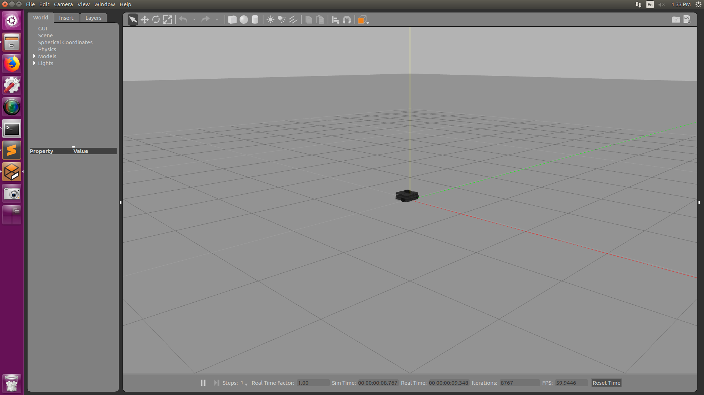

**Note:** How to create the turtlebot model is out of the scope of this tutorial. However for more information view the file ```/catkin_ws/src/turtlebot3/turtlebot3_description/urdf/turtlebot3_waffle_pi.gazebo.xacro```

### Viewing Sensor Data

Now that we can place the robot in the simulation. Let's figure out how we can access and inspect the sensor data. We can inspect the data using a new terminal. Lets first see what data our robot is publishing:

```
$ rostopic list
```

Lets then see what the scan data comprises of.

```
$ rostopic info /scan
```

We will first notice that it is for type [sensor_msgs/LaserScan](http://docs.ros.org/melodic/api/sensor_msgs/html/msg/LaserScan.html). Looking at this documentation, we can see what all the different data we should be able to access. **Note** you should find that the data published in this topic matches with the description of the laser scanner in the robots description ```/catkin_ws/src/turtlebot3/turtlebot3_description/urdf/turtlebot3_waffle_pi.gazebo.xacro```

We can double check its publishing correctly using:

```
$ rostopic echo /scan
```

Running this command you should see this output:


You will notice that all ranges are inf. That is because the robot is being simulated in an open world, with no obstacles in sight. Lets manually add an obstacle. To do that click the box icon in the toolbar of gazebo. Then move your mouse to somewhere in front of the robot and place the box. Your final world should look like this:

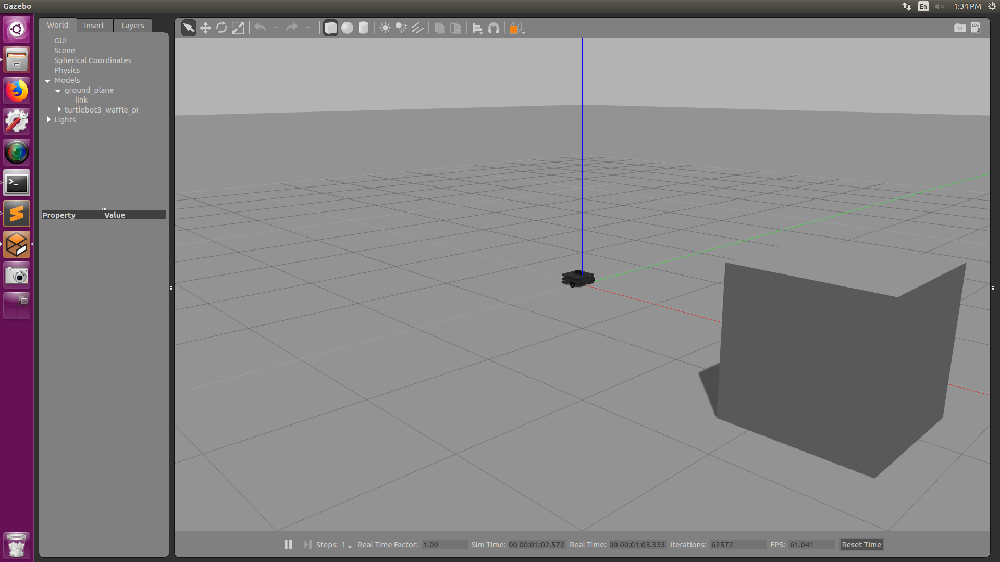

Checking the laser scanner topic again we should notice that the output has changed to match the image below:

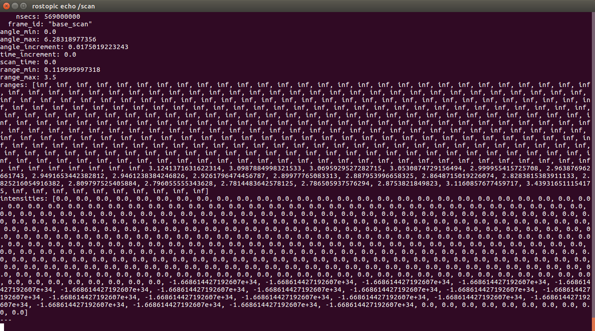


Let's try and visualize the data in RViz. To open RViz we can run the following command

```
$ export TURTLEBOT3_MODEL=waffle_pi
$ roslaunch turtlebot3_gazebo turtlebot3_gazebo_rviz.launch
```

We should see RViz launch as seen below:


RViz is also able to display other data. For instance, we can view the camera data by selecting the camera topic in RViz. The output of this would look like the image shown below:


Let's see if we can understand what we did. The first thing we launched was the ```turltebot3_empty_world.launch``` file. Inside that file we will see the following:

```
<launch>
  <arg name="model" default="$(env TURTLEBOT3_MODEL)" doc="model type [burger, waffle, waffle_pi]"/>
  <arg name="x_pos" default="0.0"/>
  <arg name="y_pos" default="0.0"/>
  <arg name="z_pos" default="0.0"/>

  <include file="$(find gazebo_ros)/launch/empty_world.launch">
    <arg name="world_name" value="$(find turtlebot3_gazebo)/worlds/empty.world"/>
    <arg name="paused" value="false"/>
    <arg name="use_sim_time" value="true"/>
    <arg name="gui" value="true"/>
    <arg name="headless" value="false"/>
    <arg name="debug" value="false"/>
  </include>

  <param name="robot_description" command="$(find xacro)/xacro --inorder $(find turtlebot3_description)/urdf/turtlebot3_$(arg model).urdf.xacro" />

  <node pkg="gazebo_ros" type="spawn_model" name="spawn_urdf" args="-urdf -model turtlebot3_$(arg model) -x $(arg x_pos) -y $(arg y_pos) -z $(arg z_pos) -param robot_description" />
</launch>
```

We can see we first create an argument named model. With a starting position 0,0,0. If we wanted to move the robot we could change the starting position. The next include includes the ```empty_world.launch``` file. You can find this file in:

```
$ cd /opt/ros/kinetic/share/gazebo_ros/launch/
$ cat empty_world.launch
```

Finally, the gazebo node is launched. The second file is the customized RViz launch file ```turtlebot3_gazebo_rviz.launch```. Inside that file we will see the following:

```
<launch>
  <arg name="model" default="$(env TURTLEBOT3_MODEL)" doc="model type [burger, waffle, waffle_pi]"/>

  <include file="$(find turtlebot3_bringup)/launch/turtlebot3_remote.launch">
    <arg name="model" value="$(arg model)"/>
  </include>

  <node name="rviz" pkg="rviz" type="rviz" args="-d $(find turtlebot3_gazebo)/rviz/turtlebot3_gazebo_model.rviz"/>
</launch>
```

Inside this file, we can see that we are launching the node ```rviz``` with a custom save file ```turtlebot3_gazebo_model.rviz```. Inside that is where all the correct setting have been checked which allow RViz to straight away know what you want to display. 

Let's see if we can mimic this behavior without using the launch file. Launch RViz by default:

```
$ rosrun rviz rviz
```

This command should launch a window which looks similar to this:

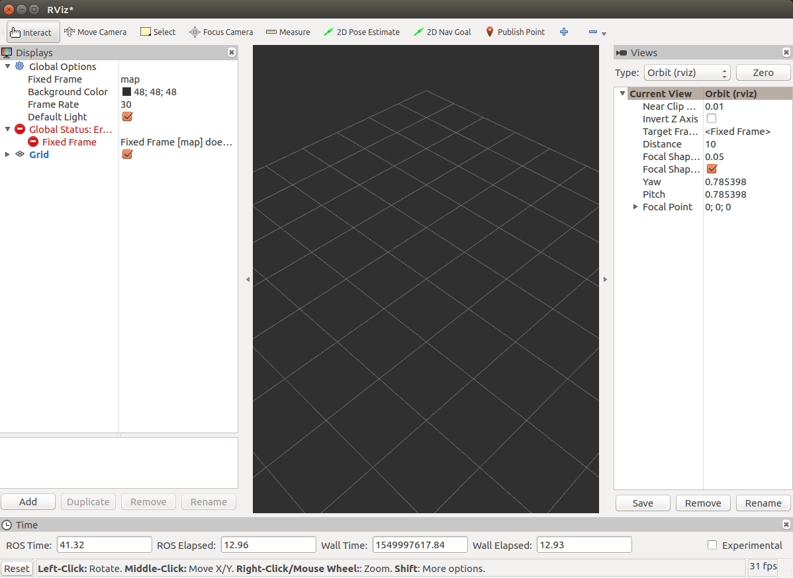

Firstly change the Fixed Frame from map to odom. You can do this as shown in the image below:


Next, let's say we want to visualize the laser scan data. We can do that by clicking add on the bottom left and then selecting the laser scan. This will open a dialog where you can select laser scan as shown below:

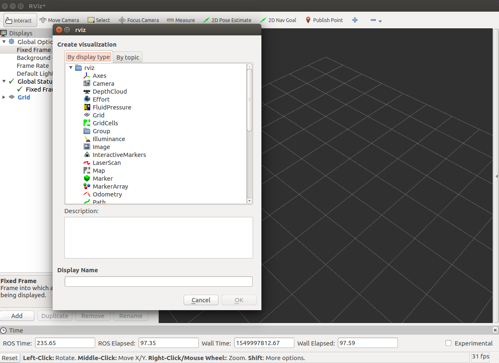

Once you had the laser scan topic, next you need to change the scan topic to ```/scan```. You will notice that we get an error as shown below. That base_scan does not exist.

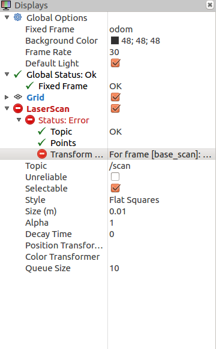

The error relates to the state of the robot not being published, and thus RViz is unable to transform the laser scan data into anything meaningful. We can solve this by launching a state publisher. The state publisher node can be launched using the following launch file.

```
$ roslaunch turtlebot3_bringup turtlebot3_remote.launch
```

After launching this file, you should notice that the topic starts to receive messages as shown below:


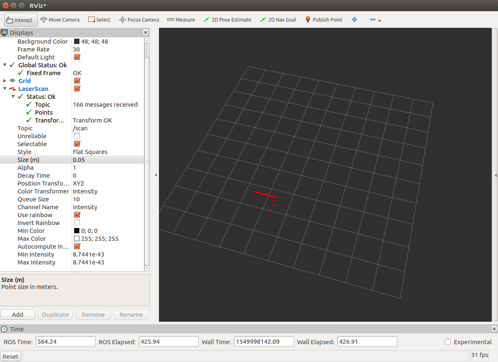

Why did it do that? It publishes the coordinate transformation such as base_footprint. You can see what transforms it has published using:

```
$ rostopic echo /tf_static
```

How did we know that tf_static is published by robot_state_publisher. I used rqt_graph. This is another tool which we can use to visualize how the ROS system is made. We can access rqt_graph using:

```
$ rosrun rqt_graph rqt_graph
```

Change the top left dropdown to nodes/topics(All). You should have the following output:

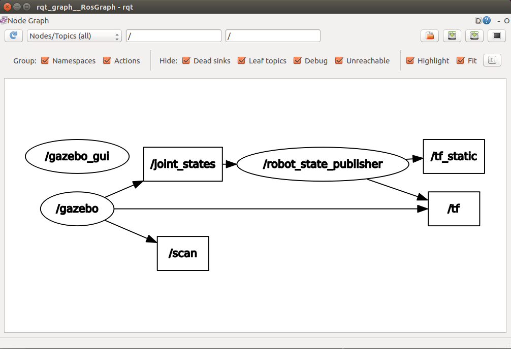


### Controlling the Robot in Simulation

Lets now see how we could drive the robot around a room. To do this let's open a more complex world. I found which worlds I have available by inspecting the ```catkin_ws/src/turtlebot3_simulations/turtlebot3_gazebo/launch``` folder.

```
$ export TURTLEBOT3_MODEL=waffle_pi
$ roslaunch turtlebot3_gazebo turtlebot3_autorace.launch
```

Gazebo should launch and look as follows:


In another terminal launch the node which takes the keyboard commands and converts them into velocity commands for the robot:

```
$ roslaunch turtlebot3_teleop turtlebot3_teleop_key.launch
```

You can now drive the robot around the simulation using the w,a,s,d keys. You should see something similar to below, notice my robot has moved positions.


Let's see if we can visualize data while driving around. We will use the preconfigured rviz launch file.

```
$ export TURTLEBOT3_MODEL=waffle_pi
$ roslaunch turtlebot3_gazebo turtlebot3_gazebo_rviz.launch
```

You should see the following output, notice how we can see the room using the laser scan data.

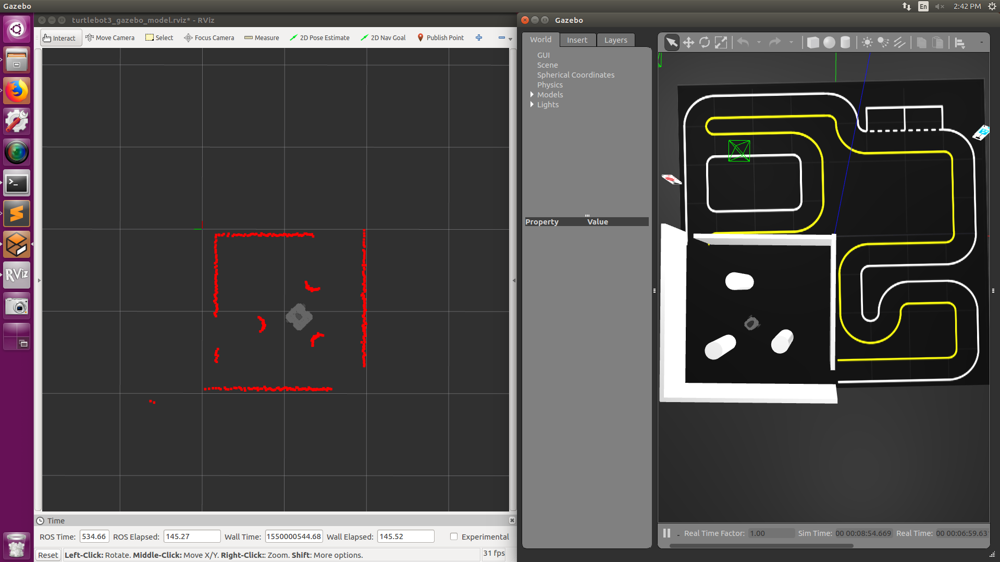

### Creating a Map

We are also able to create maps using RViz and Gazebo. This example has an implementation of simultaneous localization and mapping [SLAM](https://en.wikipedia.org/wiki/Simultaneous_localization_and_mapping). Let's see how it works and if we can visualize the data in RViz. First let's open a more realistic world, one which we would probably try and map in the real world. Open a house world using:

```
$ export TURTLEBOT3_MODEL=waffle_pi
$ roslaunch turtlebot3_gazebo turtlebot3_house.launch
```

You should see the following world open in Gazebo:

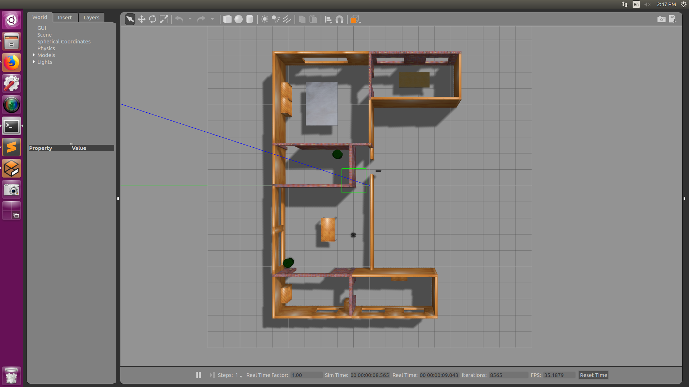

Let's launch the slam visualization

```
$ export TURTLEBOT3_MODEL=waffle_pi
$ roslaunch turtlebot3_slam turtlebot3_slam.launch slam_methods:=gmapping
```

We will notice that the robot is now creating a map object as well as displaying the laser scanner as shown below:


Let's see what happens if we drive around the room. To drive the robot, launch the teleop package.

```
$ roslaunch turtlebot3_teleop turtlebot3_teleop_key.launch
```

After driving around for a while, we should be left with a fully mapped out house as can be seen below:


We can see we can map a house using our robot. For this tutorial I won't be going into the details of SLAM, however, let's figure out how it was plotted to RViz. The first thing we will notice is that it is published to a ```/map``` topic. Let's see what type of message it is publishing:

```
$ rostopic info /map
```

You should get the following output:


We will notice it is of type [nav_msgs/OccupancyGrid](http://docs.ros.org/melodic/api/nav_msgs/html/msg/OccupancyGrid.html). I have included some of the documentation below:

```
# This represents a 2-D grid map, in which each cell represents the probability of
# occupancy.

Header header 

#MetaData for the map
MapMetaData info

# The map data, in row-major order, starting with (0,0).  Occupancy
# probabilities are in the range [0,100].  Unknown is -1.
int8[] data
```

That makes sense so we are expecting a 2D array with probabilities between 0-100 of whether or not an object is there. Lets see if we can see this in on the map topic. We can view the raw map topic using:

```
$ rostopic echo /map
```

Running this will get you the following output:


### Argument Passing using a Launch File

We can give our launch files arguments. Let's look at what kind of arguments we can send the empty_world launch file. I have attached the launch file below:

```
<launch>
  <arg name="model" default="$(env TURTLEBOT3_MODEL)" doc="model type [burger, waffle, waffle_pi]"/>
  <arg name="x_pos" default="0.0"/>
  <arg name="y_pos" default="0.0"/>
  <arg name="z_pos" default="0.0"/>z

  <include file="$(find gazebo_ros)/launch/empty_world.launch">
    <arg name="world_name" value="$(find turtlebot3_gazebo)/worlds/empty.world"/>
    <arg name="paused" value="false"/>
    <arg name="use_sim_time" value="true"/>
    <arg name="gui" value="true"/>
    <arg name="headless" value="false"/>
    <arg name="debug" value="false"/>
  </include>

  <param name="robot_description" command="$(find xacro)/xacro --inorder $(find turtlebot3_description)/urdf/turtlebot3_$(arg model).urdf.xacro" />

  <node pkg="gazebo_ros" type="spawn_model" name="spawn_urdf" args="-urdf -model turtlebot3_$(arg model) -x $(arg x_pos) -y $(arg y_pos) -z $(arg z_pos) -param robot_description" />
</launch>
```

You will notice there are two sets of arguments. The first set are the arguments for this launch file, the second set of arguments are for another launch file that this launch file calls. To pass in your own value for the arguments run the following command:

```
$ roslaunch turtlebot3_gazebo turtlebot3_empty_world.launch z_pos:="2.0" x_pos:="5.0"
```

You should see the following output as shown in the figure below. **Note** the robot will drop due to the gravity in the simulation.


You will now notice that the robot now spawns 2 meters off the ground and 5 meters in the X direction. Let's say we wanted to change the world using an argument how could we go about doing that? We would have to add an argument to the launch file which is then passed to the ```empty_world``` launch file. To do this add an argument named ```w_name``` to your launch file. Set the default value of ```w_name``` to the exact same value of ```world_name``` in he ```empty_world``` launch file. We then can pass ```w_name``` to ```world_name``` by setting its value to that of ```w_name```. This is how your launch file should look after the changes.

```
<launch>
  <arg name="model" default="$(env TURTLEBOT3_MODEL)" doc="model type [burger, waffle, waffle_pi]"/>
  <arg name="x_pos" default="0.0"/>
  <arg name="y_pos" default="0.0"/>
  <arg name="z_pos" default="0.0"/>
  <arg name="w_name" default="$(find turtlebot3_gazebo)/worlds/empty.world"/>

  <include file="$(find gazebo_ros)/launch/empty_world.launch">
    <arg name="world_name" value="$(arg w_name)"/>
    <arg name="paused" value="false"/>
    <arg name="use_sim_time" value="true"/>
    <arg name="gui" value="true"/>
    <arg name="headless" value="false"/>
    <arg name="debug" value="false"/>
  </include>

  <param name="robot_description" command="$(find xacro)/xacro --inorder $(find turtlebot3_description)/urdf/turtlebot3_$(arg model).urdf.xacro" />

  <node pkg="gazebo_ros" type="spawn_model" name="spawn_urdf" args="-urdf -model turtlebot3_$(arg model) -x $(arg x_pos) -y $(arg y_pos) -z $(arg z_pos) -param robot_description" />
</launch>

```

To run this launch file we can use the following command:

```
$ roslaunch turtlebot3_gazebo turtlebot3_empty_world.launch w_name:="{PATH TO DIRECTORY}/worlds/empty.world"
```

### Loading Premade Models in Gazebo

**NOTE** I will be using the previous tutorial to change the world using arguements

Lets take a look at the world files. World files are in a SDF format, such as this one ```catkin_ws/src/turtlebot3_simulations/turtlebot3_gazebo/worlds/empty.world```.

```
<sdf version="1.4">
  <world name="default">

    <scene>
      <ambient>0.4 0.4 0.4 1</ambient>
      <background>0.7 0.7 0.7 1</background>
      <shadows>true</shadows>
    </scene>

    <!-- A global light source -->
    <include>
      <uri>model://sun</uri>
    </include>

    <!-- A ground plane -->
    <include>
      <uri>model://ground_plane</uri>
    </include>

    <physics type="ode">
      <real_time_update_rate>1000.0</real_time_update_rate>
      <max_step_size>0.001</max_step_size>
      <real_time_factor>1</real_time_factor>
      <ode>
        <solver>
          <type>quick</type>
          <iters>150</iters>
          <precon_iters>0</precon_iters>
          <sor>1.400000</sor>
          <use_dynamic_moi_rescaling>1</use_dynamic_moi_rescaling>
        </solver>
        <constraints>
          <cfm>0.00001</cfm>
          <erp>0.2</erp>
          <contact_max_correcting_vel>2000.000000</contact_max_correcting_vel>
          <contact_surface_layer>0.01000</contact_surface_layer>
        </constraints>
      </ode>
    </physics>
  </world>

</sdf>
```

Let's see if we can add our own components to the empty world. Let's create our own world. To do this, we need to copy ```empty.world``` to a new file which we will add the components to. To do this run:

```
$ cp catkin_ws/src/turtlebot3_simulations/turtlebot3_gazebo/worlds/empty.world catkin_ws/src/turtlebot3_simulations/turtlebot3_gazebo/worlds/empty_gas.world
```

Now lets edit ```empty_gas.world``` by including a gas station between the ground plane and the physics tag. A gas station can be added using:

```
  <include>
    <uri>model://gas_station</uri>
    <name>gas_station</name>
    <pose>-2.0 7.0 0 0 0 0</pose>
  </include>
```

Your ```empty_gas.world``` should look something like this now.

```
    ...
    <!-- A ground plane -->
    <include>
      <uri>model://ground_plane</uri>
    </include>

    <include>
      <uri>model://gas_station</uri>
      <name>gas_station</name>
      <pose>-2.0 7.0 0 0 0 0</pose>
    </include>

    <physics type="ode">
      <real_time_update_rate>1000.0</real_time_update_rate>
      <max_step_size>0.001</max_step_size>
      <real_time_factor>1</real_time_factor>
      ...
```

Let's see what that looks like. Let's run the code which launches gazebo with the empty world.

```
$ export TURTLEBOT3_MODEL=waffle_pi
$ roslaunch turtlebot3_gazebo turtlebot3_empty_world.launch w_name:="{PATH TO DIRECTORY}/worlds/empty_gas.world"
```

You should see the following model spawn in your Gazebo world:


You can find a list of other models by selecting the insert tab in Gazebo and looking for the menu item http://gazebosim.org... It will look as shown below:

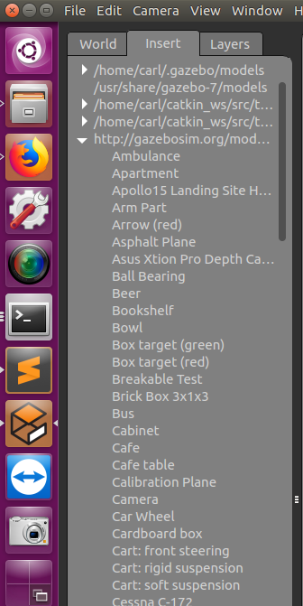

Similarly, we can add basic objects into our simulation using a similar method. Let's add a block into our newly created gas world. We can do that by creating a model and adding it to the world file. A block can be added using:

```
...
  <model name ='box'>
    <pose>1 2 0 0 0 0</pose>
    <link name ='link'>
      <pose>0 0 .5 0 0 0</pose>
      <collision name ='collision'>
        <geometry>
          <box><size>1 1 1</size></box>
        </geometry>
      </collision>
      <visual name ='visual'>
        <geometry>
          <box><size>1 1 1</size></box>
        </geometry>
      </visual>
    </link>
  </model>
...
```

You can again open the world using:

```
$ export TURTLEBOT3_MODEL=waffle_pi
$ roslaunch turtlebot3_gazebo turtlebot3_empty_world.launch w_name:="{PATH TO DIRECTORY}/worlds/empty_gas.world"
```

You should notice now the gas station has a block spawned inside it as shown below:

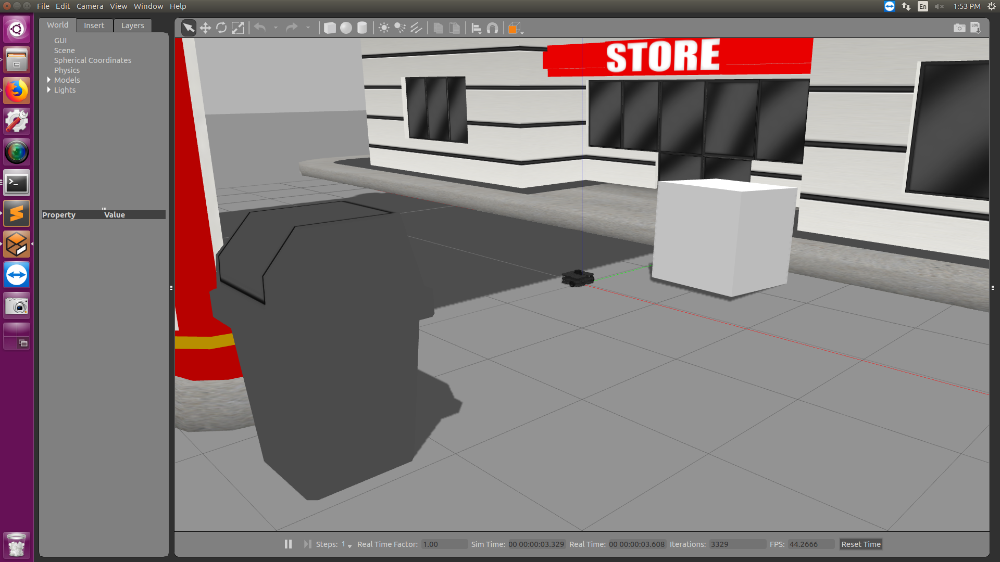

**Note** it is probably easier to create a world manually in Gazebo and save it. You can do this by clicking file -> Save World As, and then saving the world.

**Note** you can also dynamically add objects to your world using ROS. Refer to this [turotial](http://wiki.ros.org/simulator_gazebo/Tutorials/SpawningObjectInSimulation) on how to do that.

## Authors

* **Carl Hildebrandt** - *Initial work* - [hildebrandt-carl](https://github.com/hildebrandt-carl)

## Acknowledgments

Please note this work was a summary of all these sources. Please refer to them for more detail.

* http://emanual.robotis.com/docs/en/platform/turtlebot3/overview/
* http://gazebosim.org/tutorials?tut=ros_roslaunch&cat=connect_ros
* http://wiki.ros.org/roslaunch/XML/arg
* http://gazebosim.org/tutorials?tut=ros_roslaunch#UsingroslaunchtoOpenWorldModels
* http://sdformat.org/spec?elem=world
* http://learn.turtlebot.com/2015/02/03/6/
* http://gazebosim.org/tutorials?tut=plugins_world
* http://wiki.ros.org/simulator_gazebo/Tutorials/SpawningObjectInSimulation